# Тестування працездатності системи

## Запуск сервера

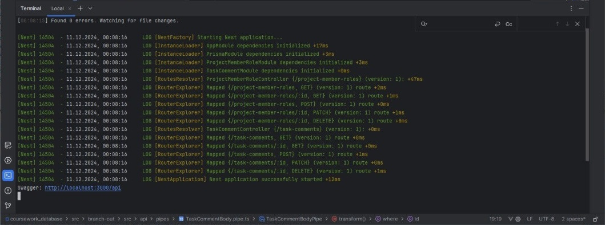

## ProjectMemberRole

### POST /ProjectMemberRole

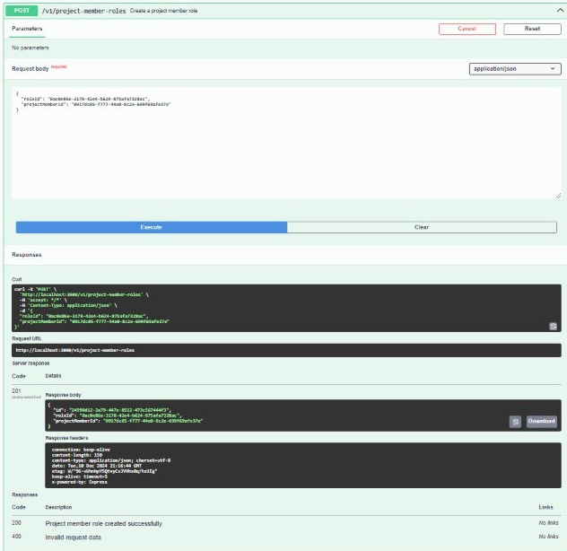

### GET /ProjectMemberRole

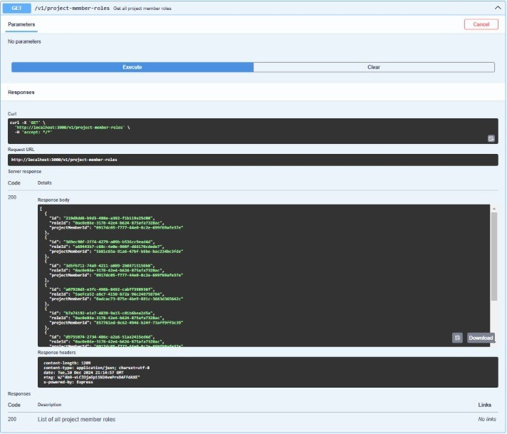

### GET /ProjectMemberRole/:id

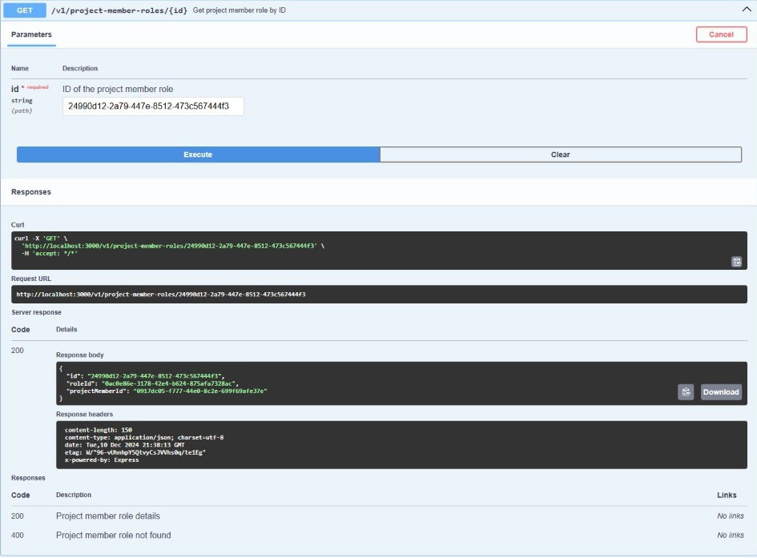

### PATCH /ProjectMemberRole/:id

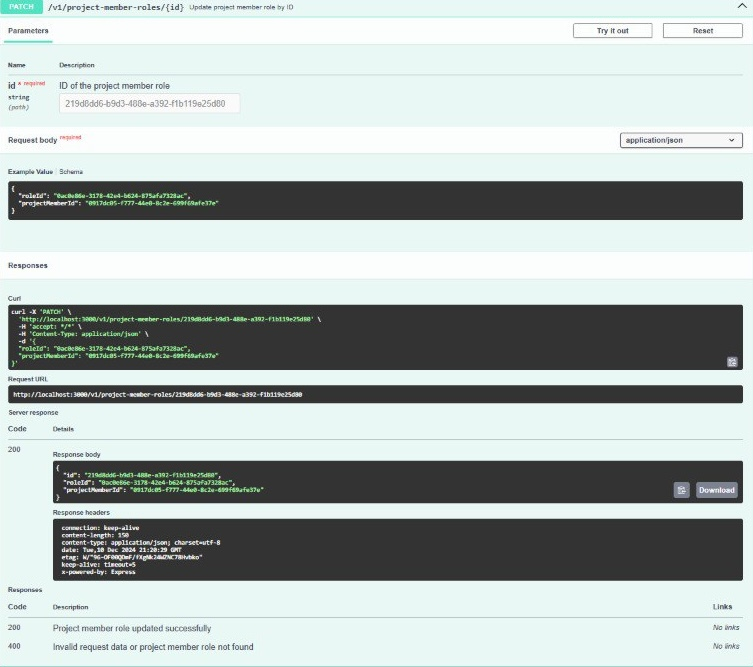

### DELETE /ProjectMemberRole/:id

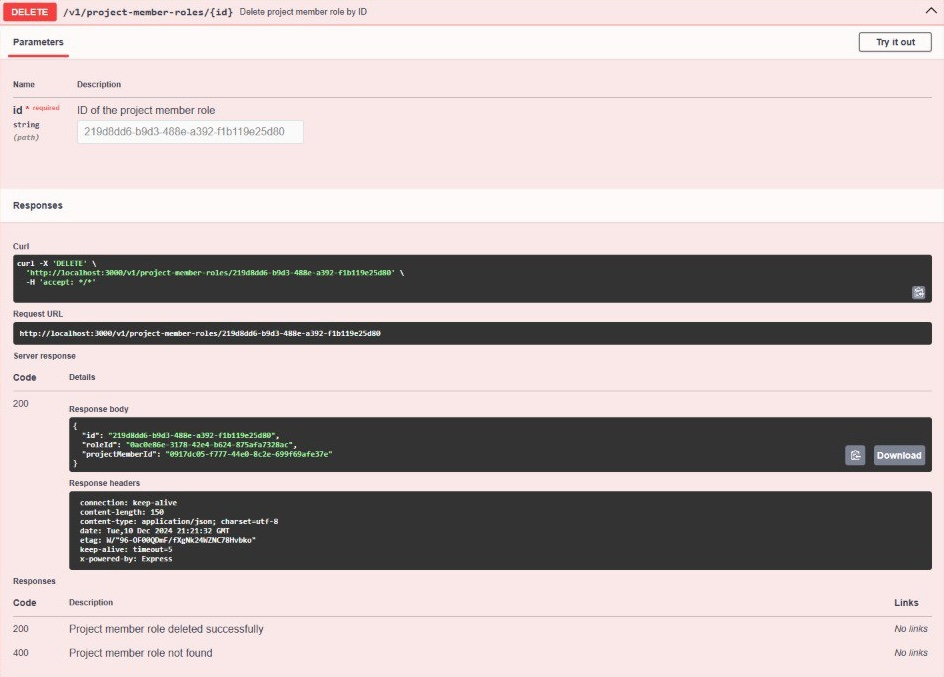

## TaskComment

### POST /TaskComment

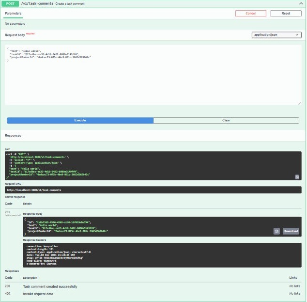

### GET /TaskComment

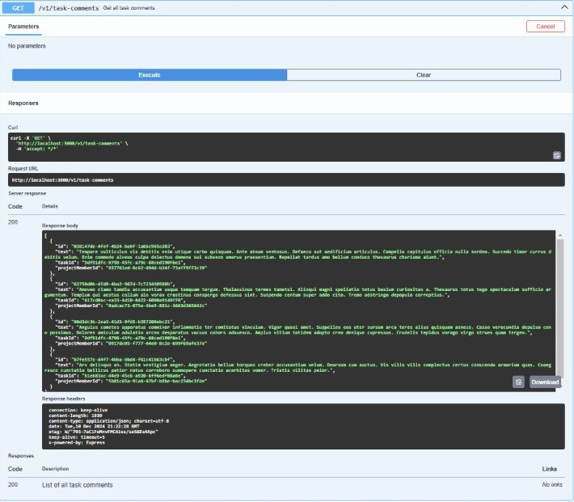

### GET /TaskComment/:id

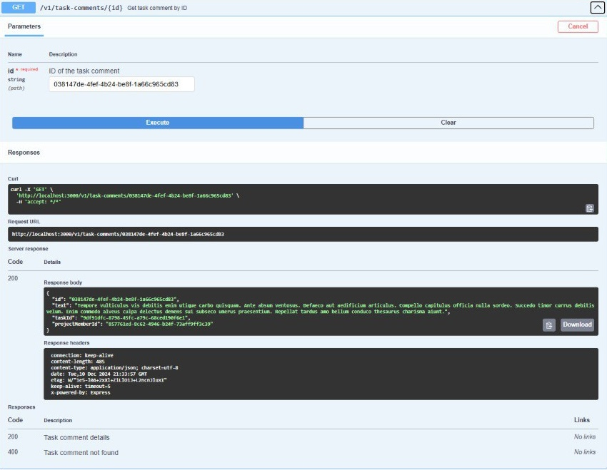

### PATCH /TaskComment/:id

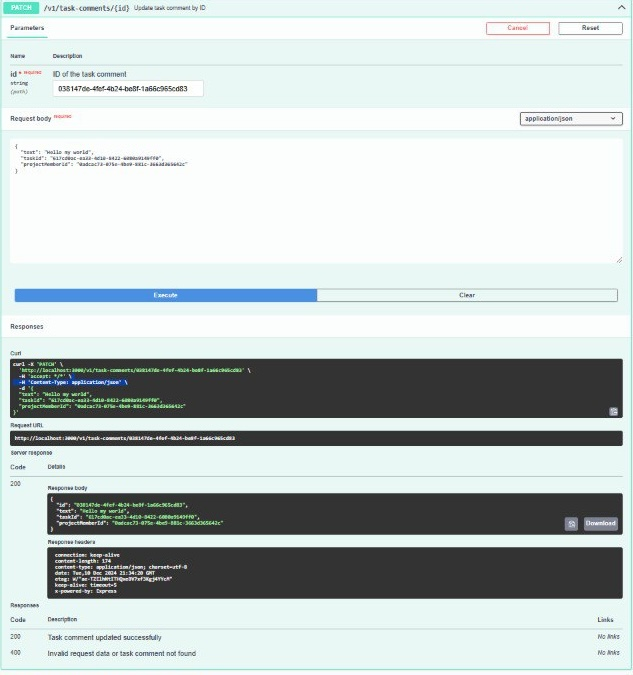

### DELETE /TaskComment/:id

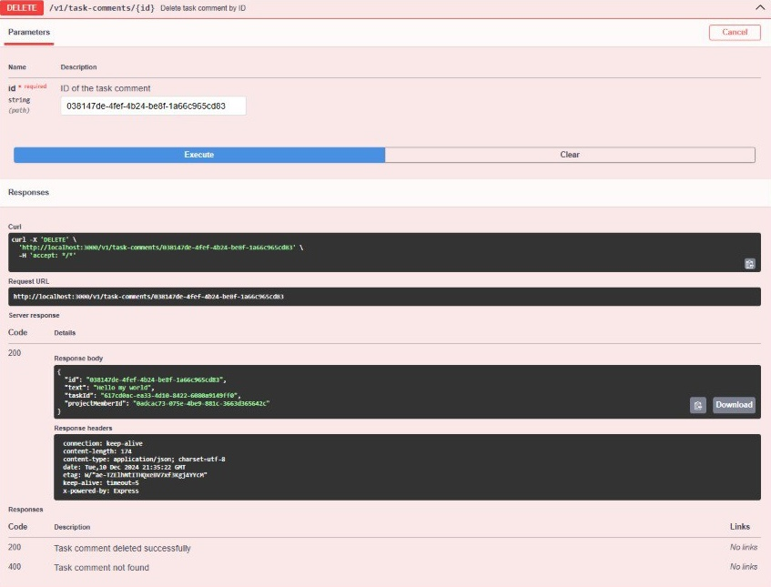